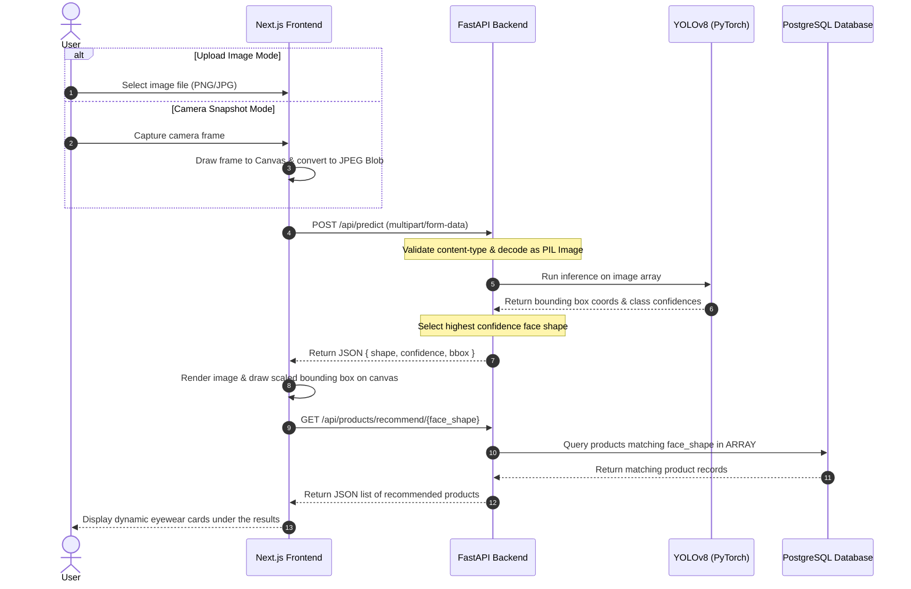

# Tecoptica: Face Shape Classifier & Dynamic Eyewear Recommender

Tecoptica is an end-to-end, high-performance face shape classification and dynamic eyewear recommendation platform. Powered by a custom-trained YOLOv8 computer vision model, a FastAPI backend service, and a Next.js interactive user interface, Tecoptica detects human face shapes and recommends matching premium eyewear styles from a live PostgreSQL database catalog.

---

## Key Features

*   **Custom YOLOv8 Vision Model**: Trained to detect and classify 5 distinct face shapes (`heart`, `oblong`, `oval`, `round`, `square`) with high confidence.
*   **Next.js Frontend**: Clean dark/light theme, interactive UI, camera snapshot mode, and drag-and-drop file upload support.
*   **FastAPI backend**: Low-latency REST API serving image inferences and managing database access.
*   **PostgreSQL Inventory Integration**: Dynamic product recommendations queried using PostgreSQL `ARRAY` models via SQLAlchemy.
*   **Interactive Streamlit Sandbox**: Model testing sandbox containing metric curves (confusion matrices, PR curves, F1 scores) and an interactive Streamlit dashboard.

---

## Pipeline Flow Architecture

Below is the complete sequence of events, from uploading an image or taking a snapshot with the camera, to executing the YOLOv8 face classification and retrieving personalized eyewear recommendations:



---

## Repository Architecture

```text
gpu-train/
├── frontend/                # Next.js Web Application
│   ├── src/app/             # Core views, admin panel & global layouts
│   └── package.json         # Node package manager configurations
├── backend/                 # FastAPI Application Server
│   ├── main.py              # REST endpoints & ML predictions
│   ├── database.py          # SQLAlchemy engine & DB session handling
│   ├── models.py            # PostgreSQL Product relations
│   └── schemas.py           # Pydantic validation layers
├── model/                   # ML Sandbox & YOLO Weights
│   ├── best.pt              # Trained PyTorch YOLO weights
│   ├── *.png/*.jpg          # Confusion matrices, PR curves, and training metrics
│   └── streamlit_app.py     # Streamlit direct model validation app
├── howrecwork.png           # Recommendation engine visualization graph
└── .gitignore               # Workspace-level git exclusions
```

---

## Code Showcases

This repository contains clean, modular, and optimized code implementations. Below are code showcases showing how the image/snapshot processing, bounding box rendering, and recommendation retrieval are handled:

### 1. Image Inference API (FastAPI)
Located in [backend/main.py](file:///c:/Users/hp/Downloads/gpu-train/backend/main.py#L64-L120), the backend handles both uploaded files and webcam snapshot captures via the same multipart endpoint:

```python
@app.post("/api/predict")
async def predict(file: UploadFile = File(...)):
    # Validate file type
    if file.content_type not in ["image/jpeg", "image/png", "image/jpg"]:
        raise HTTPException(
            status_code=400,
            detail="Invalid file type. Only PNG, JPG, and JPEG are supported.",
        )

    try:
        # Read and decode the image
        contents = await file.read()
        image = Image.open(io.BytesIO(contents)).convert("RGB")
        img_array = np.array(image)

        # Run inference
        results = model(img_array)

        if len(results) == 0 or len(results[0].boxes) == 0:
            raise HTTPException(
                status_code=404,
                detail="No face detected in the image. Please try a clearer photo.",
            )

        boxes = results[0].boxes
        confidences = boxes.conf.cpu().numpy()
        classes = boxes.cls.cpu().numpy()
        xyxy = boxes.xyxy.cpu().numpy()

        # Get highest confidence prediction
        max_conf_idx = np.argmax(confidences)
        predicted_class = int(classes[max_conf_idx])
        confidence = float(confidences[max_conf_idx])
        bbox = xyxy[max_conf_idx]

        xmin, ymin, xmax, ymax = int(bbox[0]), int(bbox[1]), int(bbox[2]), int(bbox[3])
        width = xmax - xmin
        height = ymax - ymin

        return {
            "shape": CLASS_NAMES[predicted_class],
            "confidence": round(confidence, 4),
            "bbox": {
                "xmin": xmin, "xmax": xmax,
                "ymin": ymin, "ymax": ymax,
                "width": width, "height": height,
            },
        }
    except HTTPException:
        raise
    except Exception as e:
        raise HTTPException(status_code=500, detail=f"Error processing image: {str(e)}")
```

### 2. Camera Snapshot Capturing (Next.js client)
Located in [frontend/src/app/page.tsx](file:///c:/Users/hp/Downloads/gpu-train/frontend/src/app/page.tsx#L186-L244), the client captures frames from the active webcam stream, draws them to an offline canvas, produces a JPEG blob, and sends it to the REST API:

```typescript
const capturePhoto = async () => {
  if (!videoRef.current || !stream) return;

  const video = videoRef.current;
  
  // Draw the current video frame on a canvas
  const canvas = document.createElement("canvas");
  canvas.width = video.videoWidth;
  canvas.height = video.videoHeight;
  const ctx = canvas.getContext("2d");
  if (!ctx) return;
  ctx.drawImage(video, 0, 0, canvas.width, canvas.height);
  
  const dataUrl = canvas.toDataURL("image/jpeg", 0.95);
  setCapturedImage(dataUrl);
  stopLiveCamera();

  setIsProcessing(true);
  try {
    const response = await fetch(dataUrl);
    const blob = await response.blob();
    const file = new File([blob], "capture.jpg", { type: "image/jpeg" });

    const formData = new FormData();
    formData.append("file", file);

    const res = await fetch("http://localhost:8000/api/predict", {
      method: "POST",
      body: formData,
    });

    if (!res.ok) {
      if (res.status === 404) {
        throw new Error("No face detected in the captured photo. Please try a clearer picture.");
      }
      throw new Error("Failed to get prediction");
    }

    const data = await res.json();
    setResult(data);
  } catch (error: any) {
    console.error(error);
    alert(error.message || "Error processing captured image. Please try again.");
    setCapturedImage(null);
    startLiveCamera();
  } finally {
    setIsProcessing(false);
  }
};
```

### 3. Scaled Bounding Box Drawing on Canvas
Located in [frontend/src/app/page.tsx](file:///c:/Users/hp/Downloads/gpu-train/frontend/src/app/page.tsx#L254-L292), the React application overlays predictions over dynamic elements by matching aspect ratios:

```typescript
const drawStaticBBox = useCallback((
  img: HTMLImageElement | null, 
  canvas: HTMLCanvasElement | null, 
  bbox: BBox | null, 
  shape: string | undefined, 
  confidence: number | undefined
) => {
  if (!img || !canvas || !bbox || !shape || confidence === undefined) return;

  // Match canvas dimensions to the natural image dimensions
  canvas.width = img.naturalWidth;
  canvas.height = img.naturalHeight;

  const ctx = canvas.getContext("2d");
  if (!ctx) return;

  ctx.clearRect(0, 0, canvas.width, canvas.height);
  
  // Render bounding box
  ctx.strokeStyle = "#3b82f6";
  ctx.lineWidth = Math.max(3, Math.round(img.naturalWidth / 200));
  ctx.strokeRect(bbox.xmin, bbox.ymin, bbox.width, bbox.height);

  // Render Label
  ctx.fillStyle = "#3b82f6";
  const text = `${shape.toUpperCase()} ${(confidence * 100).toFixed(1)}%`;
  const fontSize = Math.max(16, Math.round(img.naturalWidth / 40));
  ctx.font = `bold ${fontSize}px Arial`;
  const textWidth = ctx.measureText(text).width;
  const padding = fontSize * 0.6;
  
  ctx.fillRect(bbox.xmin, bbox.ymin - (fontSize + padding), textWidth + padding * 2, fontSize + padding);

  ctx.fillStyle = "#ffffff";
  ctx.fillText(text, bbox.xmin + padding, bbox.ymin - padding / 2);
}, []);
```

### 4. Eyewear Recommendation Query
Located in [backend/main.py](file:///c:/Users/hp/Downloads/gpu-train/backend/main.py#L206-L216), product recommendations are retrieved dynamically based on whether the detected shape is registered in the product's compatible array of face shapes inside the database:

```python
@app.get("/api/products/recommend/{face_shape}", response_model=list[schemas.ProductResponse])
async def recommend_products(face_shape: str, db: Session = Depends(get_db)):
    try:
        normalized_shape = face_shape.lower().strip()
        # Query products where normalized_shape is inside the face_shapes PostgreSQL text array
        recommended = db.query(models.Product).filter(
            models.Product.face_shapes.any(normalized_shape)
        ).all()
        return recommended
    except Exception as e:
        raise HTTPException(status_code=500, detail=f"Database query error: {str(e)}")
```

---

## Step-by-Step Installation & Run Guide

To run all modules of Tecoptica locally, follow the guidelines below:

### 1. Setup Virtual Environment
Run standard virtual environment installation from the repository root:
```bash
python -m venv .venv
# Activate environment
.venv\Scripts\activate      # Windows (PowerShell/CMD)
source .venv/bin/activate    # Linux/MacOS
```

### 2. Spin Up Backend (FastAPI)
Run the FastAPI development server:
```bash
cd backend
# Database URL can be configured using environment variables, or it defaults to localhost
uvicorn main:app --reload --port 8000
```
*   **Swagger API Docs**: Navigate to [http://localhost:8000/docs](http://localhost:8000/docs) once online.

### 3. Spin Up Frontend (Next.js)
Start the frontend development hot-reload server:
```bash
cd frontend
npm install
npm run dev
```
*   **Web App URL**: Access [http://localhost:3000](http://localhost:3000).

### 4. Streamlit Machine Learning Sandbox
Experiment directly with YOLO weights and view performance validation graphics:
```bash
cd model
streamlit run streamlit_app.py
```
*   **Streamlit Port**: Runs on [http://localhost:8501](http://localhost:8501).

---

## Model Training & Performance Metrics

The YOLOv8 classifier was trained using high-performance GPU resources to detect face shapes accurately. The metric verification reports are saved in the [model/](file:///c:/Users/hp/Downloads/gpu-train/model/) directory:
*   **Confusion Matrix**: [confusion_matrix.png](file:///c:/Users/hp/Downloads/gpu-train/model/confusion_matrix.png) showcases class-by-class predictive accuracy.
*   **Precision-Recall Curve**: [BoxPR_curve.png](file:///c:/Users/hp/Downloads/gpu-train/model/BoxPR_curve.png) highlights precision vs recall tradeoff balance.
*   **F1 Confidence Curve**: [BoxF1_curve.png](file:///c:/Users/hp/Downloads/gpu-train/model/BoxF1_curve.png) demonstrates optimized model confidence thresholding.


